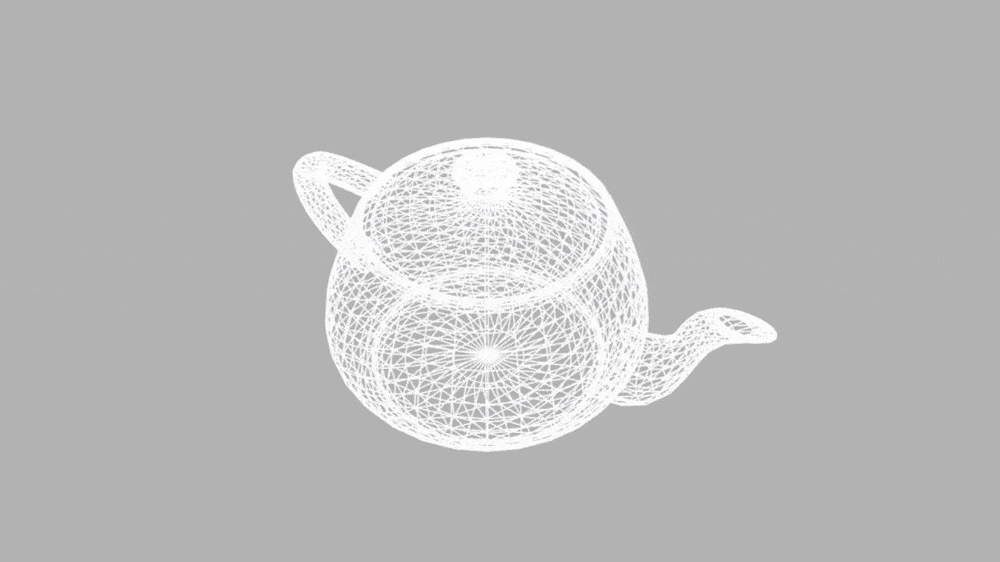

# Artistic Rendering
An in-browser viewer of various lighting techniques, ranging from stylized cartoon shading to photorealistic lighting models, applied to 3D objects in OBJ format.

## Demo


## Features
- OBJ file loader
- Gouraud shader
- Phong shader
- Toon (cartoon) shader
- Normal mapping (vertex and fragment shaders)

## User interface

<table style="width:100%">
  <thead>
    <tr>
      <th>Control</th>
      <th>Description</th>
    </tr>
  </thead>
  <tbody>
    <tr>
      <td><strong>Choose a 3D OBJ</strong></td>
      <td>Select from built-in models (e.g. Stanford bunny, Utah teapot, sphere, hippo, head).</td>
    </tr>
    <tr>
      <td><strong>Choose a shading model</strong></td>
      <td>Switch the rendering pipeline (e.g., debugging wireframe, Phong, Toon, normal map).</td>
    </tr>
    <tr>
      <td><strong>Choose a light</strong></td>
      <td>Adjust the type of light source used in the scene (e.g. ambient, point, directional).</td>
    </tr>
    <tr>
      <td><strong>Apply a texture</strong></td>
      <td>Toggles different material textures (e.g. none, gravel, bark, stained glass).</td>
    </tr>
    <tr>
      <td><strong>Toon Outline Thickness</strong></td>
      <td>Alter the outline thickness (Toon shader only).</td>
    </tr>
  </tbody>
</table>


## Build instructions

1. Install [Node.js](https://nodejs.org/).

2. Install dependencies.
```bash
npm install
```

3. Launch development server.
```bash
npm run start
```

## License

Material for [CSCI 4611 Spring 2024](https://github.com/CSCI-4611-Spring-2024/Syllabus) by [Evan Suma Rosenberg](https://illusioneering.umn.edu/) is licensed under a [Creative Commons Attribution-NonCommercial-ShareAlike 4.0 International License](http://creativecommons.org/licenses/by-nc-sa/4.0/).
